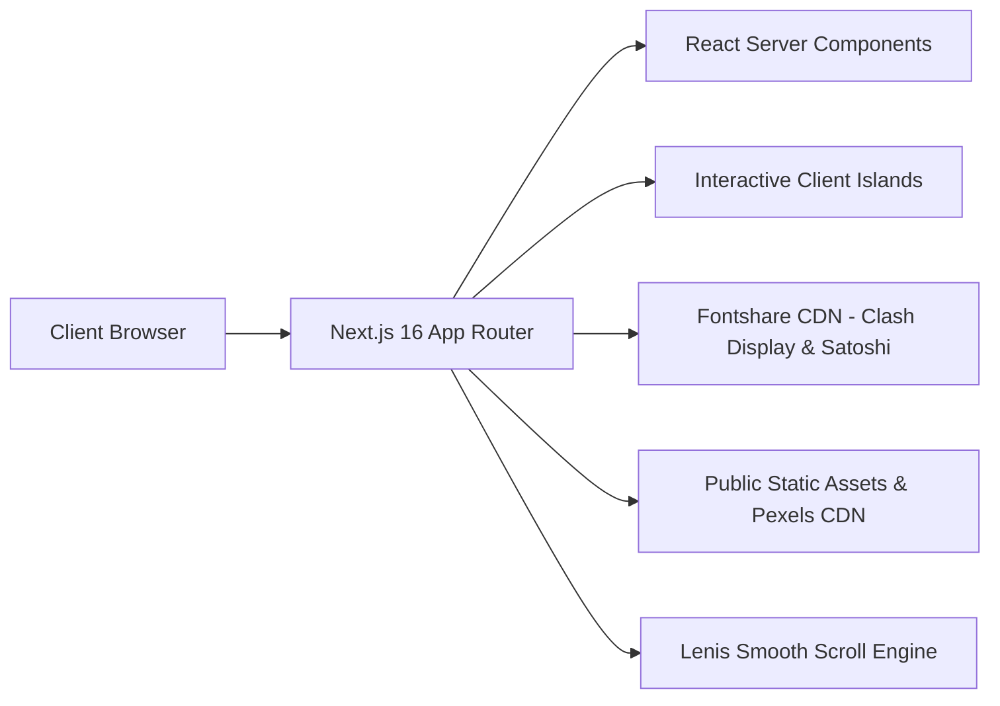
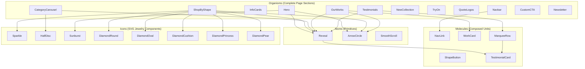
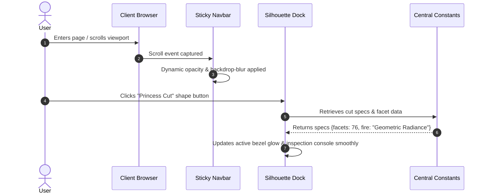

### ZALES — SYSTEM ARCHITECTURE SPECIFICATION (Next.js)


Comprehensive architectural design document outlining the technical structure, component taxonomy, data flow, rendering strategy, and design systems for the Zales Luxury Landing Page web application.

**Developer:** Aaditya Gunjal - Full Stack Developer

## Core Architectural Principles

**Server-First Rendering Architecture** - Root layout and initial page structures render as React Server Components, delivering pre-rendered semantic HTML to the client for lightning-fast First Contentful Paint (FCP) and optimal search engine discoverability.

**Atomic Design Methodology** - Strict component modularity separating UI primitives into Atoms (foundational triggers and observers), Icons (custom SVG geometry), Molecules (composed cards and interactive toggles), and Organisms (standalone page sections).

**CSS-First Token System** - Zero-configuration Tailwind CSS 4 utilizing `@theme` directives directly in `globals.css`, eliminating redundant config files while providing compile-time type-safety for luxury design tokens.

**Smooth Scroll Integration** - Unified Lenis smooth scroll provider mounted at the application boundary, orchestrating the requestAnimationFrame cycle while preventing conflicts with sticky navigation elements and keyboard navigation.

## System Context Diagram



## Component Hierarchy & Taxonomy



## Directory Architecture

```
src/
├── app/
│   ├── globals.css             # Theme definitions, keyframes, scroll utilities
│   ├── layout.tsx              # Root HTML shell, fonts, smooth scroll provider
│   ├── page.tsx                # Single-page layout composition
│   └── robots.ts               # Crawler routing configuration
├── components/
│   ├── atoms/                  # Foundation primitives (Reveal, ArrowCircle, SmoothScroll)
│   ├── icons/                  # Custom luxury SVG icons (Diamonds, Sunburst, Sparkle)
│   ├── molecules/              # Interactive composite controls (Cards, Marquees)
│   └── organisms/              # 12 full-width responsive landing sections
├── constants/                  # Single source of truth for static datasets
├── hooks/                      # Custom React hooks (useCarousel, useIntersectionObserver)
├── types/                      # Comprehensive TypeScript interface definitions
└── utils/                      # Pure helper utilities (cn helper, tests)
```

## Data Flow & State Management



## Technology Stack

| Technology    | Version | Purpose                                           |
| ------------- | ------- | ------------------------------------------------- |
| Next.js       | 16.3.8  | App Router, Server Components, Turbopack bundling |
| React         | 19.2.6  | Modern component framework with client hooks      |
| TypeScript    | 5.9.3   | Strict compile-time type verification             |
| Tailwind CSS  | 4.1.17  | Modern utility-first CSS styling engine           |
| Lenis         | 1.3.26  | Hardware-accelerated smooth scrolling             |
| Lucide React  | 1.49.0  | Clean UI utility iconography                      |
| Clash Display | CDN     | Display typography for headings via Fontshare     |
| Satoshi       | CDN     | Modern sans-serif body typography via Fontshare   |
| Vitest        | 3.0.0   | Fast unit testing for utility algorithms          |

## Contact & Support


- **Email:** [aadigunjal0975@gmail.com](mailto:aadigunjal0975@gmail.com)
- **LinkedIn:** [aadityagunjal0975](https://www.linkedin.com/in/aadityagunjal0975/)
- **Developer:** Aaditya Gunjal - Full Stack Developer

## License


Copyright (c) 2026 Aaditya Gunjal. Released under the MIT License.
