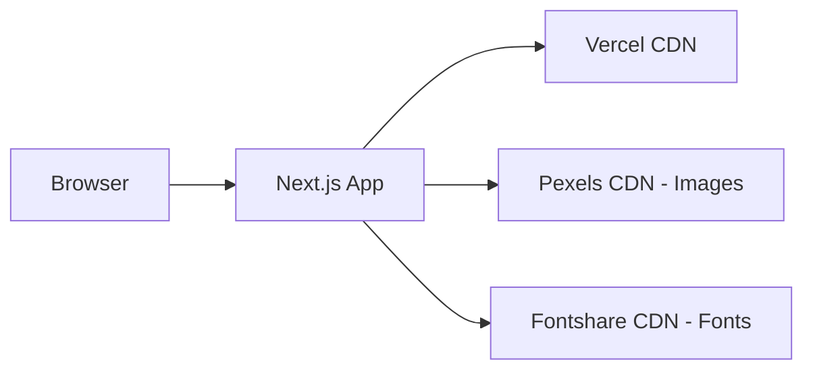
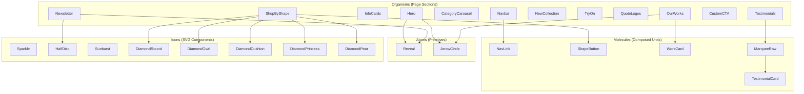
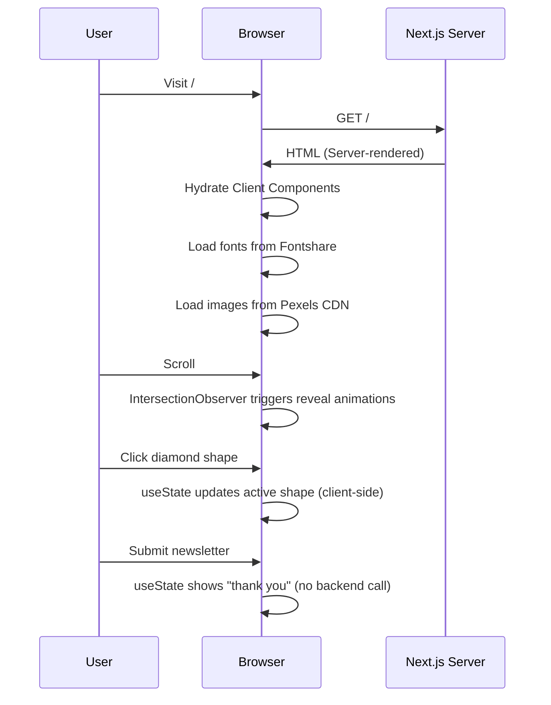

# Architecture

## System Context

This is a static landing page. There is no backend, database, or external API integration. All content is hardcoded in TypeScript constant files.

## Component Hierarchy

The project follows Atomic Design with three layers:

## Rendering Strategy

| Component        | Type   | Reason                                          |
| ---------------- | ------ | ----------------------------------------------- |
| `layout.tsx`     | Server | Static shell, no interactivity                  |
| `page.tsx`       | Server | Composes organisms, no state                    |
| Navbar           | Client | `useState` for mobile menu                      |
| Hero             | Client | `useState` for slide index                      |
| InfoCards        | Server | Pure display                                    |
| ShopByShape      | Client | `useState` for active shape                     |
| CategoryCarousel | Client | `useState` for carousel index                   |
| OurWorks         | Client | `useState` for featured index                   |
| NewCollection    | Client | `useState` for active tag                       |
| TryOn            | Server | Pure display                                    |
| QuoteLogos       | Server | Pure display                                    |
| Testimonials     | Server | Pure display (CSS animations)                   |
| CustomCTA        | Server | Pure display                                    |
| Newsletter       | Client | `useState` for form                             |
| Reveal           | Client | `useRef` + `useEffect` for IntersectionObserver |

**Total: 7 Client Components, 8 Server Components**

## Data Flow

There is no data flow. All content lives in `src/constants/` as typed TypeScript arrays. Components import constants directly.

## Known Limitations

- Newsletter form is UI-only — no backend processing
- No image optimization for external Pexels URLs (kept as ``)
- Fonts loaded from external CDN (Fontshare) — not self-hosted
- No analytics or tracking

## Evolution Paths

1. **CMS integration**: Replace `constants/` with headless CMS (Sanity, Contentful)
2. **E-commerce**: Add product pages with dynamic routes (`app/products/[slug]/page.tsx`)
3. **Auth**: Add Clerk or Auth.js for user accounts
4. **i18n**: Use `next-intl` for multi-language support
