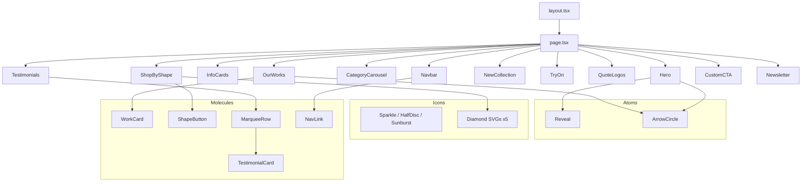

# Zales — You Deserve the Most Unique Jewelry

Premium jewelry landing page built with Next.js 16, Tailwind CSS 4, and TypeScript.

## Stack

| Layer           | Technology                           |
| --------------- | ------------------------------------ |
| Framework       | Next.js 16 (App Router, Turbopack)   |
| Language        | TypeScript 5.9 (strict)              |
| Styling         | Tailwind CSS 4 (CSS-first config)    |
| Icons           | Lucide React + custom SVG components |
| Package Manager | pnpm 12                              |
| Node            | 22                                   |
| Deployment      | Vercel                               |

## Architecture



## Quick Start

```bash
# Prerequisites: Node.js 22+, pnpm 12+
pnpm install
pnpm dev
# Open http://localhost:3000
```

## Scripts

| Command             | Description                  |
| ------------------- | ---------------------------- |
| `pnpm dev`          | Start dev server (Turbopack) |
| `pnpm build`        | Production build             |
| `pnpm start`        | Start production server      |
| `pnpm lint`         | ESLint check                 |
| `pnpm lint:fix`     | ESLint auto-fix              |
| `pnpm format`       | Prettier format              |
| `pnpm format:check` | Prettier check               |
| `pnpm typecheck`    | TypeScript check             |
| `pnpm test`         | Run tests                    |
| `pnpm check`        | All checks combined          |

## Project Structure

```
src/
├── app/                     # Next.js App Router
│   ├── layout.tsx           # Root layout (fonts, metadata)
│   ├── page.tsx             # Home page (composes organisms)
│   └── globals.css          # Tailwind + theme + animations
├── components/
│   ├── atoms/               # Smallest reusable components
│   ├── icons/               # SVG icon components
│   ├── molecules/           # Composed from atoms
│   └── organisms/           # Full page sections
├── constants/               # Static data arrays
├── hooks/                   # Custom React hooks
├── types/                   # Shared TypeScript types
└── utils/                   # Utility functions
```

## Deployment

Push to GitHub and import on [Vercel](https://vercel.com). Zero configuration needed — Vercel auto-detects Next.js.

## Roadmap

The following features are planned but not yet implemented:

- [ ] E-commerce checkout integration
- [ ] User accounts and authentication
- [ ] CMS integration for dynamic content
- [ ] Internationalization (i18n)
- [ ] Analytics dashboard
- [ ] AI-powered virtual try-on backend

## Documentation

- [Architecture](./ARCHITECTURE.md)
- [Contributing](./CONTRIBUTING.md)
- [Setup Guide](./docs/SETUP.md)
- [ADRs](./docs/ADRs/)

## License

[MIT](./LICENSE)
